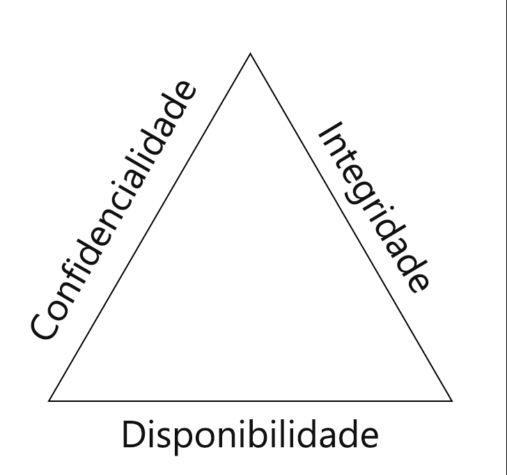

# [Cyber Segurança](https://www.microsoft.com/pt-pt/security/business/security-101/what-is-cybersecurity)

## Modelo CID (Confidencial, Integro e Dísponivel)

CIA - *Confidentiality, Integrity, and Availability*

<figure markdown="span">

<figcaption>Modelo CID/CIA</figcaption>
</figure>

* **Confidencialidade** : A informação só deve ser visível às pessoas certas.
* **Integridade** : A informação só deve ser alterada pelas pessoas ou processos certos.
* **Disponibilidade** : A informação deve ser visível e acessível sempre que necessário.

---

## Mitigação de Ameaças

### Potenciais Pontos de Entrada

* Contas de Email
* Contas de redes sóciais
* Dispositivos móveis
* A infraestrutura tecnológica da organização
* Serviços em nuvem
* Pessoas (Peopleware)

### Vetores de Ataque

* Meios de comunicação amovíveis
* O navegador
* Serviços na nuvem
* Os infiltrados

### Falhas de Segurança

Acesso não autorizado a dispositivos, serviços, redes ou sistemas

* Ataques de engenharia social
* Ataques de navegador
* Ataques de palavra-passe

### Violação de dados

Ocorre quando o intruso obtém com sucesso acesso ou controlo de dados

---

## Malware

**Software malicioso**: Infecta sistemas e realizão ações danosas, roubo de informação e disrrupção do sistema.

Malware tem dois componentes principais:

* Mecanismo de propagação
* Carga útil

### Mecanismo de Propagação

* Virus - acção de utilizador para se propagar
* Worm - explora vulnerabilidades nos sistemas
* Trojan - software que se faz passar como fidedigno mas secretamente atua maliciosamente

### Carga Útil

Ação que o Malware provoca no dispositivo ou sistema infetado

* **Ransomware** - bloqueia sistemas ou dados até que a vítima pague um resgate. A encriptação de dados é uma das tecnicas utilizada pelo cibercriminoso.
* **Spyware** - espia um dispositivo ou sistema. Recolhe informação e transmite ao intruso sem que o utilizador se aperceba.
* **Backdoors** - exploração de uma vulnerabilidade num sistema ou dispositivo para contornar as medidas de segurança existentes e causar danos.
* **Botnet** - rede de dispositivos infetados que podem ser controlados remotamente para realizar ações nefastas.

---

## Estratégia de Mitigação

Medidas de prevenção ou defesa de ciberataques.

Implementação de politicas e processos organizacionais com o objectivo de evitar e minimizar potenciais ciberataques.

* Autenticação multifator - para além de uma senha de acesso no sistema o utilizador faz uma segunda autenticação através de um dispositivo fora do sistema, biometria ou hardware pessoal.

### Segurança do Navegador

* Impedir a instalação de extensões ou add-ons não autorizados do navegador.
* Só permitem a instalação de navegadores autorizados em dispositivos.
* Bloqueio de certos sites utilizando filtros de conteúdo da web.
* Manter navegadores atualizados.

### Formação do Peopleware

* Identificar elementos suspeitos numa mensagem.
* Nunca responder a pedidos externos de informação pessoal.
* Bloquear os dispositivos quando não estão a ser utilizados.
* Armazenar, partilhar e remover dados de acordo com as políticas da organização.

### Informações sobre ameaças

Tomar o maior número possível de medidas para monitorizar, prevenir, defender contra ataques e identificar possíveis vulnerabilidades.

Recolha de informações dos sistemas, detalhes sobre vulnerabilidades, informações sobre ataques.

**Inteligência da Ameaça** - A recolha de informações para responder a ciberataques.

---

# [ENISA (Agência da União Europeia para a Cibersegurança)](https://www.enisa.europa.eu/)

## REGULAMENTO (UE)

[2019/881 DO PARLAMENTO EUROPEU E DO CONSELHO](https://eur-lex.europa.eu/legal-content/PT/TXT/?uri=CELEX:32019R0881)

## Regulamento (PT)

### Regime Jurídico da Segurança do Ciberespaço

#### [Decreto-Lei n.º 65/2021, de 30 de julho](https://dre.pt/dre/detalhe/decreto-lei/65-2021-168697988?_ts=1673395200034)

---

# [GNS - Gabinete Nacional de Segurança](https://www.gns.gov.pt/)

Segurança

Fisica

* Acesso
* Protecão climatica

Logica

* Antivirus - detecção de software malicioso
* Firewall - acesso à rede

Dimensão Legal e Normativa

Seguro Electrónico

Risco como fator de Decisão

---

# [Confiança Zero](https://www.microsoft.com/pt-pt/security/business/zero-trust)

[Security.org](https://www.security.org/)

---

# Cyber Attack Maps

## [Cyber Attack Map](https://talosintelligence.com/fullpage_maps/pulse#)

## [Live Cyber Threat Map](https://threatmap.checkpoint.com/)

## [Fortinet](https://threatmap.fortiguard.com/)

## [Kaspersky](https://cybermap.kaspersky.com/pt)

## [Threatbutt Internet Hacking Attack Attribution Map](https://threatbutt.com/map/)
